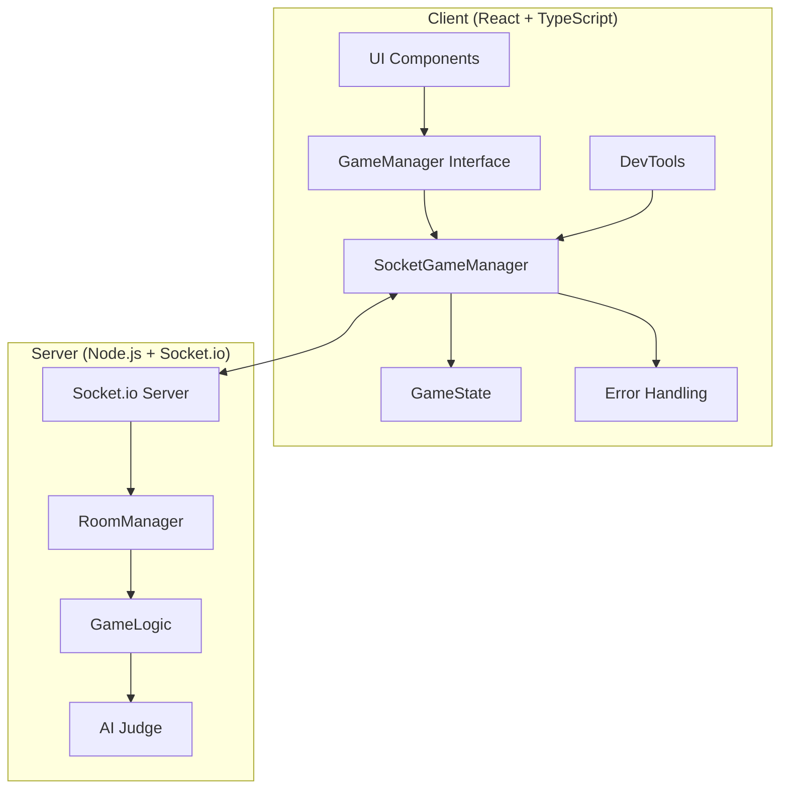
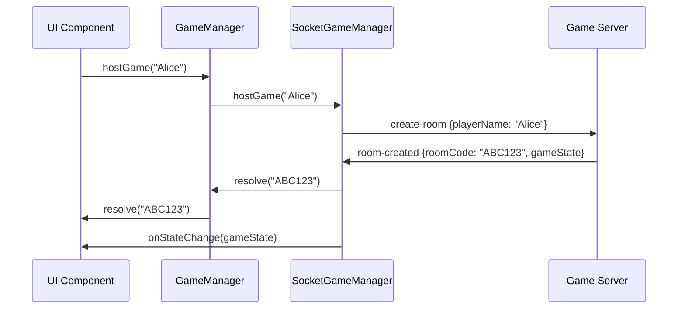
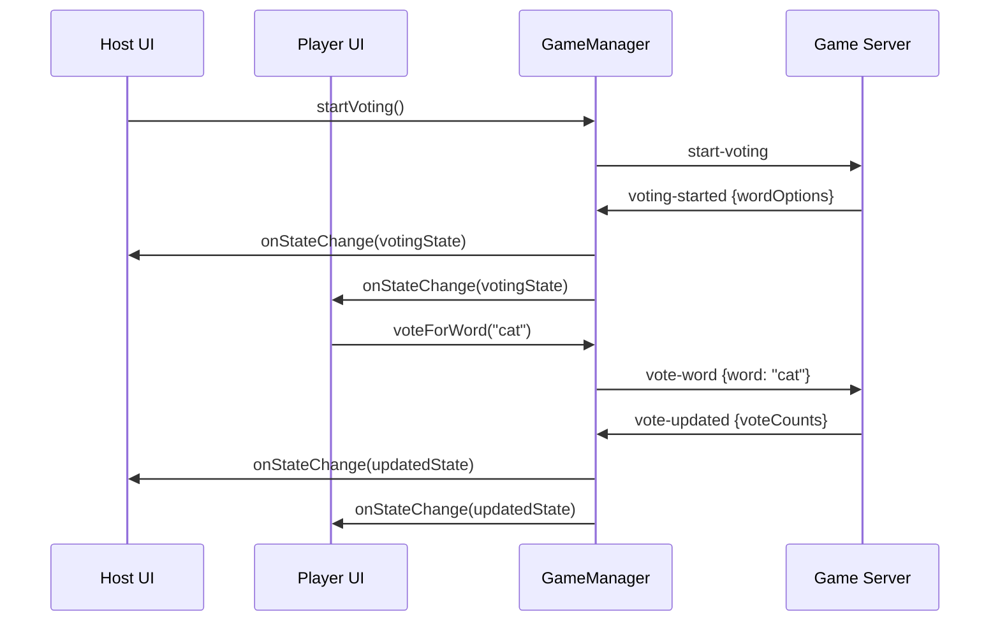
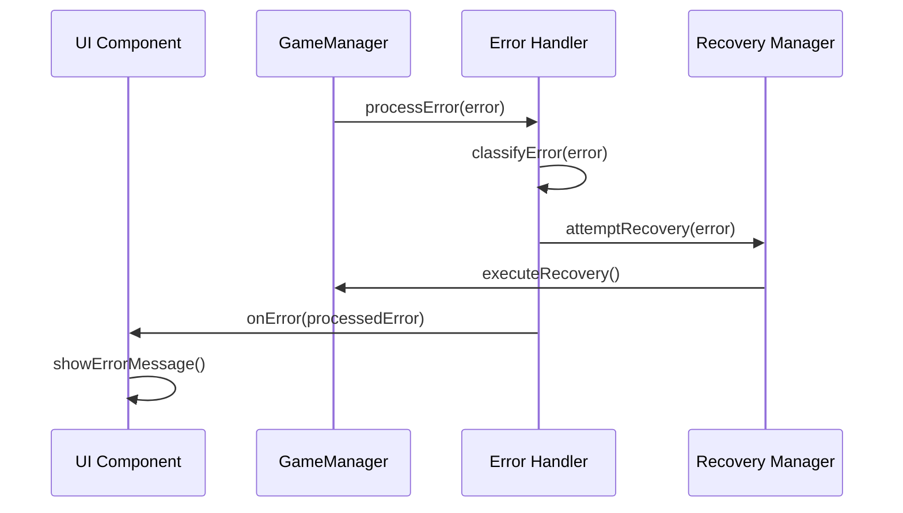

# Doodle Game Architecture Documentation

## Overview

The Doodle multiplayer drawing game is built with a unified architecture that consolidates around Socket.io for real-time communication while providing a clean separation of concerns between networking, game logic, and UI components.

## Table of Contents

- [Architecture Overview](#architecture-overview)
- [Design Decisions](#design-decisions)
- [Core Components](#core-components)
- [Data Flow](#data-flow)
- [Error Handling Strategy](#error-handling-strategy)
- [Testing Architecture](#testing-architecture)
- [Performance Considerations](#performance-considerations)
- [Security Measures](#security-measures)

## Architecture Overview



### Key Architectural Principles

1. **Unified Interface**: All game operations go through the `GameManager` interface
2. **Separation of Concerns**: UI, networking, and game logic are clearly separated
3. **Error Resilience**: Comprehensive error handling with automatic recovery
4. **Testability**: All components are designed to be easily testable
5. **Developer Experience**: Rich debugging tools and clear documentation

## Design Decisions

### 1. Socket.io vs P2P Architecture

**Decision**: Standardize on Socket.io for all networking

**Rationale**:
- Server-authoritative architecture prevents cheating
- Better reliability than P2P (no NAT traversal issues)
- Easier to scale and deploy
- Better integration with AI judging system
- Existing Socket.io implementation was more complete

**Trade-offs**:
- Requires server infrastructure (vs P2P's serverless approach)
- Single point of failure (mitigated by proper error handling)
- Slightly higher latency (negligible for turn-based gameplay)

### 2. Interface-Based Design

**Decision**: Use TypeScript interfaces for all major components

**Rationale**:
- Enables easy testing with mocks
- Provides clear contracts between components
- Allows for future implementation swapping
- Improves code maintainability

### 3. Centralized State Management

**Decision**: Single GameState object managed by GameManager

**Rationale**:
- Single source of truth for all game data
- Easier to debug and reason about
- Simplifies state synchronization
- Enables time-travel debugging

## Core Components

### GameManager Interface

The `GameManager` is the central interface that UI components interact with. It provides:

- **Connection Management**: Host/join games, handle disconnections
- **Game Actions**: Start voting, vote for words, submit drawings
- **State Management**: Get current state, subscribe to changes
- **Error Handling**: Centralized error reporting and recovery

```typescript
interface GameManager {
  // Connection
  hostGame(playerName: string): Promise<string>;
  joinGame(playerName: string, roomCode: string): Promise<void>;
  disconnect(): void;
  
  // Game Actions
  startVoting(): void;
  voteForWord(word: string): void;
  submitDrawing(canvasData: string): void;
  
  // State Management
  getGameState(): GameState | null;
  onStateChange(callback: GameStateChangeCallback): void;
  
  // Error Handling
  onError(callback: GameErrorCallback): void;
}
```

### SocketGameManager Implementation

The `SocketGameManager` is the concrete implementation using Socket.io:

- **Network Communication**: Handles all Socket.io messaging
- **Connection Resilience**: Automatic reconnection with exponential backoff
- **State Synchronization**: Keeps local state in sync with server
- **Error Recovery**: Implements various recovery strategies

### GameState Structure

The `GameState` contains all information about the current game:

```typescript
interface GameState {
  // Connection Info
  roomCode: string;
  isConnected: boolean;
  connectionStatus: 'connecting' | 'connected' | 'disconnected' | 'error';
  
  // Player Management
  players: Player[];
  currentPlayer: Player | null;
  hostId: string;
  
  // Game Flow
  gamePhase: 'lobby' | 'voting' | 'drawing' | 'judging' | 'results';
  
  // Phase-specific Data
  wordOptions: string[];
  voteCounts: Record<string, number>;
  chosenWord: string;
  timeRemaining: number;
  results: GameResult[];
}
```

### Error Handling System

The error handling system provides:

- **Error Classification**: Categorizes errors by type and severity
- **Recovery Strategies**: Automatic and manual recovery options
- **User-Friendly Messages**: Converts technical errors to user messages
- **Logging and Monitoring**: Comprehensive error tracking

## Data Flow

### 1. Game Hosting Flow



### 2. Voting Flow



### 3. Error Handling Flow



## Error Handling Strategy

### Error Categories

1. **Connection Errors**: Network failures, timeouts, server unreachable
2. **Validation Errors**: Invalid input data, malformed requests
3. **Game Logic Errors**: Invalid state transitions, unauthorized actions
4. **Rate Limiting**: Too many requests, throttling

### Recovery Strategies

1. **Automatic Retry**: For transient network issues
2. **Reconnection**: For connection losses
3. **User Action Required**: For validation errors
4. **Fallback Modes**: For critical failures

### Error Classification Matrix

| Error Type | Severity | Recovery | Auto Retry | User Action |
|------------|----------|----------|------------|-------------|
| CONNECTION_FAILED | High | Reconnect | Yes | Optional |
| ROOM_NOT_FOUND | Medium | User Action | No | Required |
| INVALID_PLAYER_NAME | Low | User Action | No | Required |
| RATE_LIMITED | Medium | Retry | Yes | None |

## Testing Architecture

### Testing Layers

1. **Unit Tests**: Individual component testing with mocks
2. **Integration Tests**: Component interaction testing
3. **End-to-End Tests**: Full game flow testing
4. **Performance Tests**: Load and stress testing

### Testing Tools

- **Jest**: Unit and integration testing framework
- **React Testing Library**: Component testing utilities
- **DevTools Service**: Game state simulation and debugging
- **Automated Test Runner**: Scenario-based testing

### Test Structure

```
src/
├── __tests__/
│   ├── components/
│   ├── services/
│   └── utils/
├── components/
│   └── __tests__/
├── services/
│   └── __tests__/
└── utils/
    └── __tests__/
```

## Performance Considerations

### Network Optimization

1. **Message Batching**: Combine frequent updates
2. **Compression**: Compress large payloads (drawing data)
3. **Connection Pooling**: Efficient connection management
4. **Caching**: Cache static data and assets

### Memory Management

1. **Message History Limits**: Prevent memory leaks
2. **State Cleanup**: Clean up disconnected players
3. **Garbage Collection**: Proper resource disposal
4. **Event Listener Cleanup**: Remove unused listeners

### Rendering Optimization

1. **React.memo**: Prevent unnecessary re-renders
2. **useMemo/useCallback**: Optimize expensive computations
3. **Virtual Scrolling**: For large player lists
4. **Canvas Optimization**: Efficient drawing operations

## Security Measures

### Input Validation

1. **Client-Side Validation**: Immediate feedback
2. **Server-Side Validation**: Security enforcement
3. **Sanitization**: Clean user inputs
4. **Rate Limiting**: Prevent abuse

### Data Protection

1. **No Sensitive Data Storage**: Avoid storing personal info
2. **Secure Communication**: Use HTTPS/WSS in production
3. **CORS Configuration**: Proper cross-origin settings
4. **Error Message Sanitization**: Don't leak internal details

### Game Integrity

1. **Server Authority**: Server validates all actions
2. **State Verification**: Detect client-server desync
3. **Anti-Cheat Measures**: Validate drawing submissions
4. **Session Management**: Secure room codes and player IDs

## Deployment Architecture

### Environment Configuration

```typescript
interface EnvironmentConfig {
  serverUrl: string;
  reconnectAttempts: number;
  connectionTimeout: number;
  logLevel: 'debug' | 'info' | 'warn' | 'error';
  enableDevMode: boolean;
}
```

### Environment-Specific Settings

- **Development**: Local server, debug logging, dev tools enabled
- **Staging**: Test server, info logging, limited dev tools
- **Production**: Production server, error logging, no dev tools

### Monitoring and Observability

1. **Error Tracking**: Centralized error reporting
2. **Performance Monitoring**: Response times and throughput
3. **Connection Health**: Network quality metrics
4. **User Analytics**: Game flow and engagement metrics

## Future Considerations

### Scalability

1. **Horizontal Scaling**: Multiple server instances
2. **Load Balancing**: Distribute connections
3. **Database Integration**: Persistent game data
4. **CDN Integration**: Static asset delivery

### Feature Extensions

1. **Multiple Game Modes**: Different game types
2. **Spectator Mode**: Watch games in progress
3. **Replay System**: Save and replay games
4. **Social Features**: Friends, leaderboards, achievements

### Technology Evolution

1. **WebRTC Integration**: Direct peer communication for drawing
2. **Progressive Web App**: Offline capabilities
3. **Mobile Optimization**: Touch-friendly interfaces
4. **AI Enhancements**: Better drawing analysis and feedback