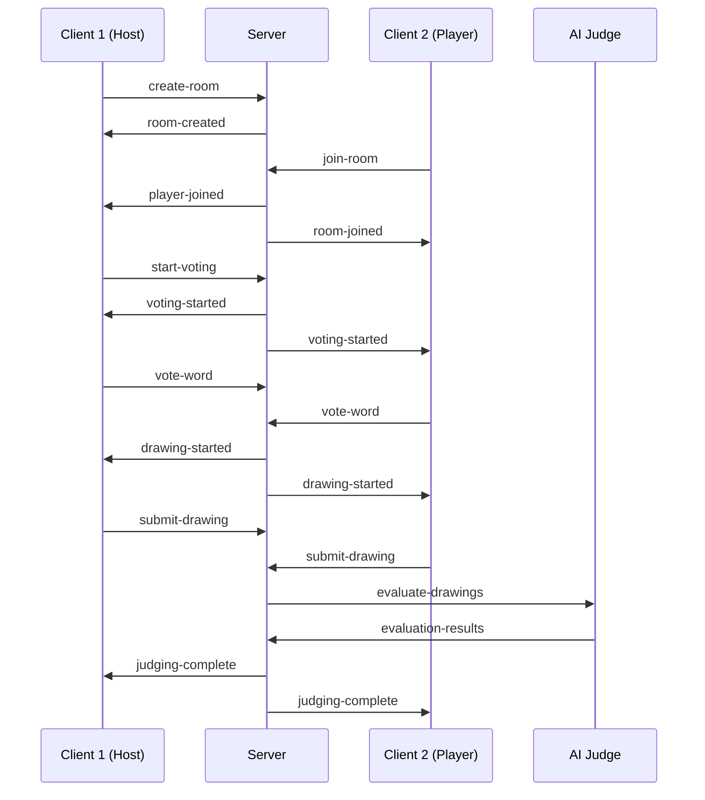

# Doodle Game Server

Node.js backend server for the Doodle multiplayer drawing game with Socket.io real-time communication.

## Overview

This is the server-side application that handles:

- **Real-time Communication**: Socket.io for instant multiplayer updates
- **Game Logic**: Room management, voting, and game flow control
- **AI Integration**: Drawing evaluation and scoring
- **Player Management**: Connection handling and state synchronization

## Features

- **🏠 Room Management**: Create and manage game rooms with unique codes
- **👥 Player Handling**: Real-time player join/leave with state sync
- **🗳️ Voting System**: Word voting with automatic tie-breaker resolution
- **🎨 Drawing Processing**: Canvas data handling and validation
- **🤖 AI Judging**: Intelligent drawing evaluation and scoring
- **🔄 Connection Resilience**: Automatic reconnection and error recovery
- **📊 Logging**: Comprehensive logging and monitoring

## Quick Start

### Prerequisites

- Node.js 16+
- npm or yarn
- OpenAI API key (for AI judging)

### Installation

```bash
# Install dependencies
npm install

# Set up environment variables
cp .env.example .env
# Edit .env with your configuration

# Start the server
npm start
```

### Environment Configuration

Create a `.env` file in the server directory:

```env
# Server Configuration
PORT=3001
NODE_ENV=development

# AI Integration
OPENAI_API_KEY=your_openai_api_key_here

# Logging
LOG_LEVEL=debug

# Game Configuration
MAX_PLAYERS_PER_ROOM=8
DRAWING_TIME_LIMIT=60
ROOM_CODE_LENGTH=6
```

## Available Scripts

```bash
npm start              # Start production server
npm run dev            # Start development server with hot reload
npm test               # Run test suite
npm run lint           # Run ESLint
npm run format         # Format code with Prettier
```

## API Endpoints

### HTTP Endpoints

```bash
GET  /health           # Health check endpoint
GET  /api/rooms        # List active rooms (development only)
POST /api/rooms        # Create new room
GET  /api/rooms/:code  # Get room information
```

### Socket.io Events

#### Client → Server Events

```javascript
// Room Management
socket.emit('create-room', { playerName: 'Alice' });
socket.emit('join-room', { roomCode: 'ABC123', playerName: 'Bob' });

// Game Actions
socket.emit('start-voting', { roomCode: 'ABC123' });
socket.emit('vote-word', { roomCode: 'ABC123', word: 'cat' });
socket.emit('submit-drawing', { roomCode: 'ABC123', canvasData: 'base64...' });
socket.emit('finish-drawing', { roomCode: 'ABC123' });

// Tie-breaker
socket.emit('tiebreaker-animation-complete', { roomCode: 'ABC123' });

// Real-time Drawing
socket.emit('drawing-stroke', { roomCode: 'ABC123', strokeData: {...} });
```

#### Server → Client Events

```javascript
// Room Events
socket.on('room-created', (data) => { /* { roomCode, gameState } */ });
socket.on('room-joined', (data) => { /* { roomCode, gameState } */ });
socket.on('player-joined', (data) => { /* { gameState } */ });
socket.on('player-left', (data) => { /* { gameState } */ });

// Game Flow Events
socket.on('voting-started', (data) => { /* { gameState } */ });
socket.on('vote-updated', (data) => { /* { gameState } */ });
socket.on('tiebreaker-started', (data) => { /* { tiedWords } */ });
socket.on('tiebreaker-resolved', (data) => { /* { chosenWord } */ });
socket.on('drawing-started', (data) => { /* { gameState } */ });
socket.on('drawing-submitted', (data) => { /* { gameState } */ });
socket.on('judging-complete', (data) => { /* { gameState } */ });

// Real-time Events
socket.on('real-time-stroke', (data) => { /* { playerId, strokeData } */ });

// Error Events
socket.on('error', (data) => { /* { message, code } */ });
```

## Architecture

### Core Components

```
server/
├── index.js              # Server entry point and Socket.io setup
├── gameManager.js         # Game logic and room management
├── gameRoom.js           # Individual room state management
├── aiJudge.js            # AI drawing evaluation
├── wordManager.js        # Word generation and management
├── config/
│   └── environment.js    # Environment configuration
└── utils/
    ├── logger.js         # Logging utilities
    ├── roomCodeGenerator.js  # Room code generation
    └── validation.js     # Input validation
```

### Game Flow



## Game Logic

### Room Management

Each game room maintains:

```javascript
{
  code: 'ABC123',           // 6-character room code
  players: [],              // Array of connected players
  hostId: 'player-id',      // ID of the room host
  gamePhase: 'lobby',       // Current game phase
  wordOptions: [],          // Available words for voting
  votes: {},                // Vote counts per word
  chosenWord: '',           // Selected word for drawing
  drawings: {},             // Submitted drawings
  results: [],              // Final AI evaluation results
  createdAt: Date,          // Room creation timestamp
  lastActivity: Date        // Last activity for cleanup
}
```

### Game Phases

1. **Lobby**: Players join and wait for host to start
2. **Voting**: Players vote on word options
3. **Drawing**: Players draw the chosen word
4. **Judging**: AI evaluates all drawings
5. **Results**: Display scores and rankings

### Voting System

- Generate 3-4 random word options
- Players vote for their preferred word
- Handle ties with automatic server-side resolution
- Notify clients of tie-breaker results

### AI Integration

The AI judge evaluates drawings based on:

- **Accuracy**: How well the drawing represents the word
- **Creativity**: Artistic interpretation and style
- **Completeness**: Whether the drawing appears finished
- **Clarity**: How recognizable the drawing is

## Configuration

### Environment Variables

```env
# Required
PORT=3001                           # Server port
OPENAI_API_KEY=sk-...              # OpenAI API key

# Optional
NODE_ENV=development               # Environment (development/production)
LOG_LEVEL=debug                    # Logging level (debug/info/warn/error)
MAX_PLAYERS_PER_ROOM=8            # Maximum players per room
DRAWING_TIME_LIMIT=60              # Drawing time in seconds
ROOM_CODE_LENGTH=6                 # Length of room codes
ROOM_CLEANUP_INTERVAL=300000       # Room cleanup interval (5 minutes)
MAX_ROOMS=1000                     # Maximum concurrent rooms
CORS_ORIGIN=http://localhost:3000  # CORS allowed origin
```

### Game Configuration

Customize game behavior in `config/environment.js`:

```javascript
module.exports = {
  game: {
    maxPlayersPerRoom: process.env.MAX_PLAYERS_PER_ROOM || 8,
    drawingTimeLimit: process.env.DRAWING_TIME_LIMIT || 60,
    votingTimeLimit: process.env.VOTING_TIME_LIMIT || 30,
    wordOptions: {
      count: 4,                    // Number of word options
      categories: ['animals', 'objects', 'actions']
    }
  },
  server: {
    port: process.env.PORT || 3001,
    corsOrigin: process.env.CORS_ORIGIN || 'http://localhost:3000'
  },
  ai: {
    model: 'gpt-4-vision-preview',
    maxTokens: 500,
    temperature: 0.7
  }
};
```

## Development

### Running in Development Mode

```bash
# Start with hot reload
npm run dev

# Enable debug logging
DEBUG=doodle:* npm run dev

# Run with specific log level
LOG_LEVEL=debug npm run dev
```

### Adding New Features

1. **Add Socket.io event handler:**
   ```javascript
   // index.js
   socket.on('new-event', (data) => {
     try {
       // Validate input
       validateNewEventData(data);
       
       // Process event
       const result = gameManager.handleNewEvent(socket.id, data);
       
       // Send response
       socket.emit('new-event-response', result);
     } catch (error) {
       socket.emit('error', { message: error.message });
     }
   });
   ```

2. **Add game logic:**
   ```javascript
   // gameManager.js
   handleNewEvent(playerId, data) {
     const room = this.findPlayerRoom(playerId);
     if (!room) {
       throw new Error('Player not in room');
     }
     
     // Implement feature logic
     const result = this.processNewFeature(room, playerId, data);
     
     // Broadcast to room
     this.broadcastToRoom(room.code, 'new-event-update', result);
     
     return result;
   }
   ```

3. **Add validation:**
   ```javascript
   // utils/validation.js
   function validateNewEventData(data) {
     if (!data || typeof data !== 'object') {
       throw new Error('Invalid data format');
     }
     
     // Add specific validation rules
   }
   ```

### Testing

```bash
# Run all tests
npm test

# Run specific test file
npm test -- --grep "GameManager"

# Run tests with coverage
npm test -- --coverage

# Run tests in watch mode
npm test -- --watch
```

### Logging

The server uses structured logging:

```javascript
const logger = require('./utils/logger');

// Log levels: debug, info, warn, error
logger.info('Player joined room', { 
  playerId: socket.id, 
  roomCode: 'ABC123',
  playerCount: room.players.length 
});

logger.error('Failed to process drawing', { 
  error: error.message,
  playerId: socket.id,
  roomCode: room.code 
});
```

## Monitoring and Debugging

### Health Checks

```bash
# Check server health
curl http://localhost:3001/health

# Response: { "status": "ok", "uptime": 12345, "rooms": 5 }
```

### Room Management

```bash
# List active rooms (development only)
curl http://localhost:3001/api/rooms

# Get specific room info
curl http://localhost:3001/api/rooms/ABC123
```

### Debug Endpoints

In development mode, additional endpoints are available:

```bash
GET /debug/rooms          # Detailed room information
GET /debug/connections    # Active socket connections
POST /debug/simulate      # Simulate game events
```

## Performance Optimization

### Connection Management

- **Connection Pooling**: Reuse database connections
- **Memory Management**: Clean up inactive rooms
- **Rate Limiting**: Prevent spam and abuse

### Scaling Considerations

- **Horizontal Scaling**: Multiple server instances
- **Load Balancing**: Distribute connections
- **Session Affinity**: Sticky sessions for Socket.io
- **Database Integration**: Persistent game data

## Security

### Input Validation

All client inputs are validated:

```javascript
// Validate room codes
if (!/^[A-Z]{6}$/.test(roomCode)) {
  throw new Error('Invalid room code format');
}

// Validate player names
if (!playerName || playerName.length > 15) {
  throw new Error('Invalid player name');
}

// Validate drawing data
if (!canvasData || canvasData.length > 1024 * 1024) {
  throw new Error('Invalid drawing data');
}
```

### Rate Limiting

Prevent abuse with rate limiting:

```javascript
const rateLimit = new Map();

function checkRateLimit(socketId, action) {
  const key = `${socketId}:${action}`;
  const now = Date.now();
  const lastAction = rateLimit.get(key) || 0;
  
  if (now - lastAction < 1000) { // 1 second cooldown
    throw new Error('Rate limit exceeded');
  }
  
  rateLimit.set(key, now);
}
```

### CORS Configuration

```javascript
const cors = require('cors');

app.use(cors({
  origin: process.env.CORS_ORIGIN || 'http://localhost:3000',
  credentials: true
}));
```

## Deployment

### Production Build

```bash
# Install production dependencies only
npm ci --only=production

# Start production server
NODE_ENV=production npm start
```

### Environment Setup

```env
# Production environment variables
NODE_ENV=production
PORT=3001
OPENAI_API_KEY=your_production_key
LOG_LEVEL=error
CORS_ORIGIN=https://your-domain.com
```

### Process Management

Use PM2 for production process management:

```bash
# Install PM2
npm install -g pm2

# Start with PM2
pm2 start index.js --name doodle-server

# Monitor
pm2 status
pm2 logs doodle-server
pm2 restart doodle-server
```

## Troubleshooting

### Common Issues

**Port Already in Use:**
```bash
# Find process using port 3001
lsof -i :3001

# Kill process
kill -9 <PID>
```

**OpenAI API Errors:**
- Check API key validity
- Verify account has credits
- Check rate limits

**Memory Leaks:**
- Monitor room cleanup
- Check for unclosed connections
- Review event listener cleanup

### Debug Mode

Enable comprehensive debugging:

```bash
# Enable all debug logs
DEBUG=* npm run dev

# Enable specific categories
DEBUG=doodle:game,doodle:ai npm run dev
```

### Monitoring

Monitor server performance:

```javascript
// Memory usage
setInterval(() => {
  const usage = process.memoryUsage();
  logger.info('Memory usage', {
    rss: Math.round(usage.rss / 1024 / 1024) + 'MB',
    heapUsed: Math.round(usage.heapUsed / 1024 / 1024) + 'MB'
  });
}, 60000);

// Active connections
setInterval(() => {
  logger.info('Server stats', {
    connections: io.engine.clientsCount,
    rooms: Object.keys(rooms).length
  });
}, 30000);
```

For more detailed information, see the main project documentation in the `../docs/` directory.